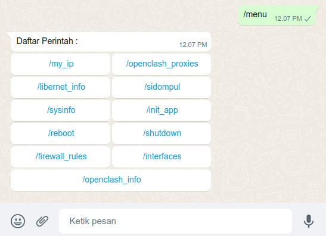

# OpenWrt Whatsapp Bot
> Whatsapp bot for OpenWrt


## </> Commands List
| Command             | Description                    | Scrennshot                              |
|---------------------|--------------------------------|-----------------------------------------|
| `/menu`             | Show command list              ||
| `/my_ip`            | Show ip address info           ||
| `/sidompul 089***`  | Show MyXl info                 ||
| `/sysinfo `         | Show system information        ||
| `/init_app`         | Show Initial App               ||
| `/reboot`           | Reboot OpenWrt device          |no screenshot|
| `/shutdown`         | Shutdown OpenWrt device        |no screenshot|
| `/firewall_rules`   | Show firewall rules            ||
| `/interfaces`       | Show Network interfaces        ||
| `/openclash_info`   | Show Openclash information     ||
| `/openclash_proxies`| Show Openclash proxies status  ||
| `/libernet_info`    | Show Libernet information      ||

## 📦 Requirements
- Node JS v14.21.3  or later
- NPM

## ⚙️ Installation
### Install from Terminal
- Update OpenWrt repo
  ``` sh 
  opkg update
  ```
- Install git
  ``` sh
  opkg install git
  ```
- Install Node and NPM
  ``` sh
  opkg install node-npm
  ```
- Clone Project
  ``` sh
  git clone https://github.com/basiooo/openwrt-whatsapp-bot.git
  ```
- Open Project Directory
  ``` sh
  cd openwrt-whatsapp-bot
  ```
- Install Node packages
  ``` sh
  npm install
  ```

## 🚀 Usage
### StartBot in background using `pm2`
- install `pm2` globaly
  ``` sh
  npm i pm2@latest -g
  ```
- start bot
  ``` sh
  pm2 start app.js --watch
  ```
- show `pm2` logs
  ``` sh
  pm2 logs
  ```

### Scan QrCode
- open `pm2` logs
  ``` sh
  pm2 logs
  ```
- scan QrCode inside the logs
- exit pm2 log using ctrl+c